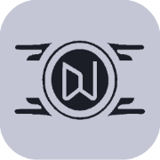

# Future Deluxe - Shopping Web App



Future Deluxe is a shopping web app inspired by Bethesda's new RPG, Starfield. It's an experimental project aimed at exploring optimal layouts and animation techniques. This project showcases a sleek and futuristic user interface, drawing inspiration from the captivating in-game UI and color schemes of Starfield and a pint of inspiration from vectors.

## Table of Contents

- [Demo](#demo)
- [Features](#features)
- [Technologies](#technologies)
- [Installation](#installation)
- [Usage](#usage)
- [Contributing](#contributing)
- [License](#license)

## Demo

For a live demo of Future Deluxe, visit [https://futuredeluxe.netlify.app](https://futuredeluxe.netlify.app)


## Features

- **Inspired by Starfield**: Future Deluxe is designed with a futuristic, space-themed UI reminiscent of Bethesda's Starfield.

- **Optimal Layouts**: The project serves as an experimental playground to discover the most efficient and appealing layout techniques.

- **Smooth Animations**: Enjoy captivating animations that enhance the user experience and give a futuristic feel to the app.

- **Minimal Functionality**: While it's a shopping web app, it's a pseudo shopping experience with minimal functionality. It uses the FakeStore API for product data.

- **Fast Speed**: Future Deluxe is optimized for speed, ensuring a seamless and snappy user experience.

## Technologies

Future Deluxe is built using the following technologies:

- **Vite**: A lightning-fast build tool for web development.
- **React**: A popular JavaScript library for building user interfaces.
- **JavaScript**: The primary programming language used for the project.
- **Bootstrap**: A front-end framework for creating responsive and visually appealing web designs.
- **HTML & CSS**: For the structure and styling of the web app.

## Installation

To run Future Deluxe on your local machine, follow these steps:

1. Clone this repository:
   ```bash
   git clone https://github.com/malikgaurav626/FutureDeluxe.git

2. Navigate to the project folder:
   ```bash
    cd FutureDeluxe

3. Install the required dependencies:
     ```bash
     npm install
   or 
     npm i

## Usage

To start the development server and run Future Deluxe locally, use the following command:
```bash
vite
```
Visit http://localhost:5173 in your web browser to access the application.

## Contributing

Contributions to Future Deluxe are welcome! If you want to contribute to this project, please follow these guidelines:

1. Fork the repository.
2. Create a new branch for your feature: `git checkout -b feature-name`.
3. Make your changes and commit them: `git commit -m 'Add new feature'`.
4. Push your branch to your forked repository: `git push origin feature-name`.
5. Create a pull request to the main repository.

We appreciate your contributions and look forward to making Future Deluxe even better together!

## License

This project is licensed under the MIT License - see the [LICENSE](./LICENSE) file for details.

---

Feel free to reach out with any questions or feedback. We hope you enjoy using Future Deluxe as much as we enjoyed creating it!

Step into a time warp with Future Deluxe, an homage to the bygone era's charm, where vintage aesthetics meet cutting-edge design in an unforgettable shopping experience!

